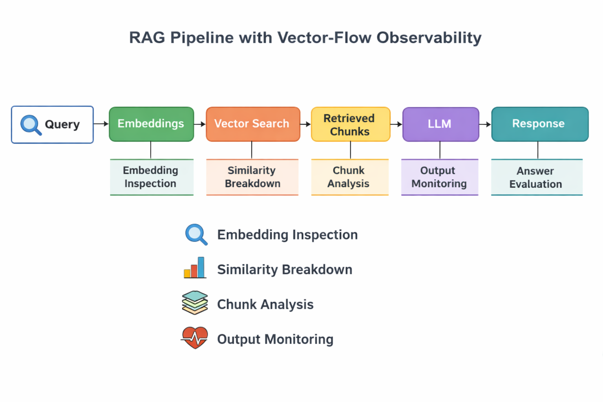

# Vector-Flow

Understanding why RAG systems fail — not just when they appear to work.
> A debugging and observability layer for analyzing failure modes in RAG pipelines.

## ❗ Problem

RAG (Retrieval-Augmented Generation) systems often fail silently.

- Irrelevant chunks are retrieved despite high similarity scores
- Important context is missed due to chunking or embedding issues
- LLMs hallucinate when retrieval quality is low

Existing tools show *what* was retrieved.  
They don’t explain *why it failed*.

## 💡 Solution

Vector-Flow is a debugging and observability layer for RAG pipelines.

It helps analyze:

- How queries are embedded
- What chunks are retrieved and why
- Where retrieval breaks down
- How context impacts LLM outputs

## 🏗️ Architecture

### Pipeline

Query → Embedding → Vector Search → Retrieved Chunks → LLM → Response

### Observability Layer (Vector-Flow)

Vector-Flow instruments each stage of the pipeline:

- **Embedding Stage**
  - Vector inspection
  - Embedding comparison across queries

- **Retrieval Stage**
  - Similarity score breakdown
  - Top-K analysis

- **Chunk Analysis**
  - Chunk relevance vs ranking
  - Missed relevant chunks

- **LLM Output**
  - Grounding vs hallucination detection

## 📌 Example: Retrieval Failure Analysis

**Query:**  
"What are the side effects of Drug X?"

**Top Retrieved Chunks:**
1. "Drug X dosage guidelines..." (Score: 0.89)
2. "History of Drug X development..." (Score: 0.87)
3. "Drug X interactions..." (Score: 0.85)

**Issue:**
- High similarity scores
- But missing the chunk containing actual side effects

**Diagnosis:**
- Embedding failed to capture intent ("side effects")
- Chunking diluted critical medical information

**Impact:**
- LLM generates incomplete or hallucinated answer

**Insight:**
High similarity does not guarantee task relevance

## 🔍 Debugging Scenarios

### 1. High similarity, low relevance
- Retrieved chunks have high cosine similarity
- But are semantically irrelevant

→ Indicates embedding limitations

---

### 2. Missing critical context
- Relevant chunks exist but are not retrieved

→ Indicates chunking or indexing issue

---

### 3. Hallucinated answers
- Retrieval quality is low
- Model fills gaps with parametric knowledge

→ Indicates weak grounding

## 🧠 Key Insights

- High cosine similarity ≠ semantic relevance
- Chunk size significantly impacts retrieval quality
- Embedding models behave differently across domains
- Retrieval failures are the root cause of most hallucinations

## 🚀 Roadmap

- [ ] Add retrieval metrics (Recall@K, MRR)
- [ ] Visualize embedding space behavior
- [ ] Compare multiple embedding models
- [ ] Add prompt-level debugging

